# 🐧 Bandit Level 0 — Starting Point

### 🎯 Challenge Summary
This is the starting point of the Bandit wargame.  
The goal is simply to connect to the Bandit server using SSH with the credentials provided on the website.

### 🧠 What This Level Is Teaching
- How to use SSH to connect to a remote Linux server  
- How to specify a custom port  
- How to begin a command‑line based challenge  

### 🧩 Hints (Medium Difficulty)
- SSH stands for *Secure Shell*  
- You need the username, hostname, and port  
- The Bandit website gives you the starting password  
- The port is **2220**, not the default 22   

### 🧪 Commands I Used
ssh bandit0@bandit.labs.overthewire.org -p 2220

### Screenshot
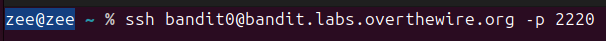

## 🐧 Bandit Level 0 → Level 1

---

### **Challenge**
Read the `README` file in the home directory to obtain the password for Level 1.

---

### **What This Level Is Teaching**
- Navigating a Linux home directory  
- Listing files  
- Reading file contents  
- Understanding basic command‑line workflow  

---

### **Hints (Medium Difficulty)**
- After logging in, list the files in the directory  
- You should see a file named `README`  
- Use a command that prints the contents of a file  
- The password for Level 1 is inside that file  

---

### **Solution (Commands I Used)**
- ls - lists files in the current directory
- cat README - prints the contents of the README file
- The README contains the password for the next level

###  Password
ZjLjTmM6FvvyRnrb2rfNWOZOTa6ip5If

## Screenshot
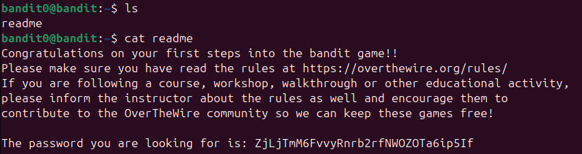

### What I Learned
I learned how to navigate the Linux filesystem and read file contents using basic commands like `ls` and `cat`. This level taught me the foundation of interacting with files directly from the terminal.

### What I Learned (Level 0 → 1)
I learned how to log into a remote Linux machine using SSH by providing a username, host, port, and password. This level taught me the basics of accessing a remote shell, which is an essential skill in DevOps because servers are often managed entirely through SSH. I also learned that each Bandit level stores the next password in a file on the server, so navigating and reading files is a core part of progressing.

# 🐧 Bandit Level 1 → Level 2

---

### **Challenge**
The password for the next level is stored in a file called - located in the home directory.
The challenge is that the filename is literally a single dash, which normally represents standard input.

---

### **What This Level Is Teaching**

- How Linux interprets filenames that look like command options
- How to safely reference unusual filenames
- How to use relative paths to avoid ambiguity
- How to avoid stdin conflicts by using ./

---

### **Hints (Medium Difficulty)**

- A filename that is just - is special in Linux
- Many commands treat - as “read from stdin”
- To force Linux to treat it as a real file, you need to give it a path prefix
Try:
- ./-
- quoting
- escaping

---

### **Solution (Commands I Used)**
- ls -l lists files in the directory and shows the file named -
- cat ./- forces Linux to treat - as a literal filename instead of stdin
- The file contains the password for Level 2

###  Password
263JGJPfgU6LtdEvgfWU1XP5yac29mFx

## Screenshot
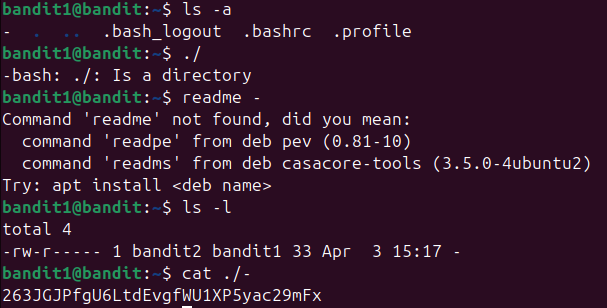

### What I Learned
I learned that filenames that look like command options (such as `-`) can confuse Linux because many commands interpret `-` as “read from standard input.” By using `./-`, I forced the shell to treat it as a real filename instead of an option.

# 🐧 Bandit Level 2 → Level 3

---

### **Challenge**
Challenge
The password for the next level is stored in a file called:

--spaces in this filename--
This filename is tricky because:

- It contains spaces
- It begins with two dashes (--), which Linux normally interprets as an option flag

So you must force the shell to treat it as a literal filename, not a command option.

---

### **What This Level Is Teaching**

- How Linux interprets filenames that look like command options
- How to safely reference unusual filenames
- How to use relative paths to avoid ambiguity
- How to avoid stdin conflicts by using ./

---

### **Hints (Medium Difficulty)**

- Filenames starting with - or -- are interpreted as options
- Use -- to tell commands:
“Stop reading options; everything after this is a filename.”
- Use quotes to handle spaces
Try:
ls -b to see escaped filenames
cat -- "<filename>"

---

### **Solution (Commands I Used)**
- cat -- "--spaces in this filename--" works because:
    - The first -- tells cat to stop parsing options
    - The quoted string is treated as the actual filename

###  Password
MNk8KNH3Usiio41PRUEoDFPqfxLPlSmx

## Screenshot
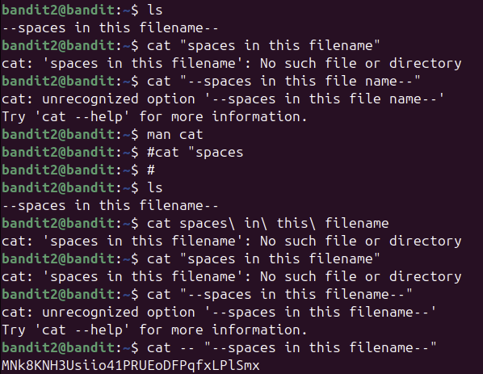

### What I Learned
I learned that filenames containing spaces or starting with dashes need special handling. Linux may treat them as multiple arguments or command flags. Using `--` stops option parsing, and quoting the filename ensures the shell treats it as a single argument. This allowed me to safely read the file named `--spaces in this filename--`.

# 🐧 Bandit Level 3 → Level 4

---

### **Challenge**
The password for the next level is stored in a hidden file inside the inhere directory.
Hidden files in Linux begin with a dot (.), so they do not appear with a normal ls.

---

### **What This Level Is Teaching**

- How to navigate directories
- How to list hidden files
- How to identify files that begin with a dot (.)
- How to read file contents using cat

---

### **Hints (Medium Difficulty)**

- Use ls to see the directory
- Use ls -a to reveal hidden files
- Hidden files start with .
- The password is inside the only hidden file in inhere

---

### **Solution (Commands I Used)**
- ls
- cd inhere
- ls -a
- cat ...Hiding-From-You

###  Password
2WmrDFRmJIq3IPxneAaMGhap0pFhF3NJ

## Screenshot
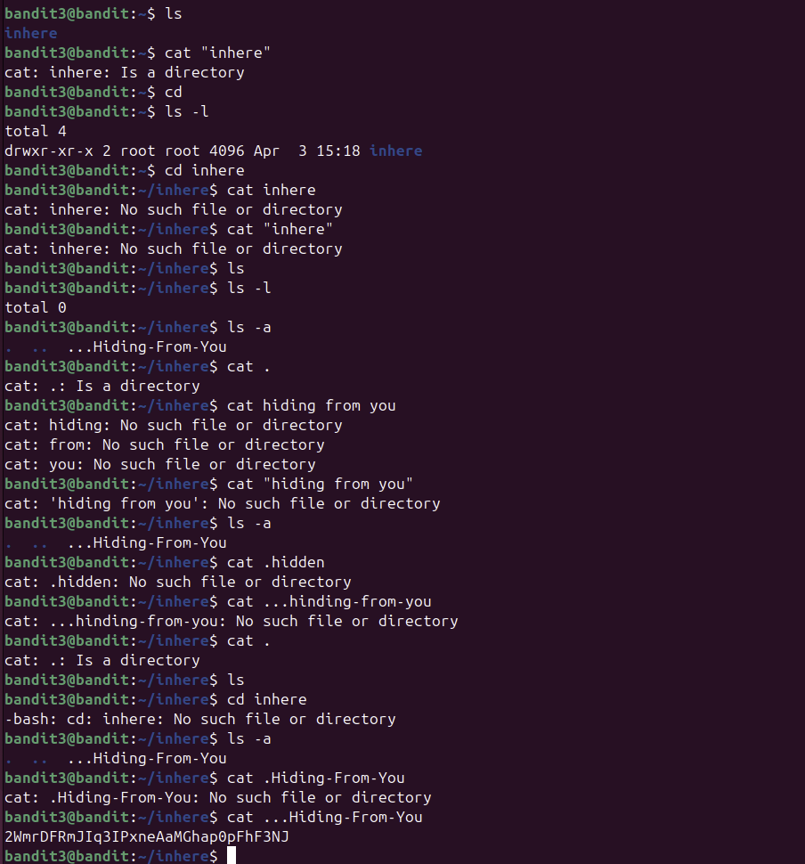

### What I Learned
I learned that hidden files in Linux begin with a dot (`.`) and do not appear with a normal `ls`. Using `ls -a` reveals hidden files, which is useful when searching for configuration files or intentionally hidden data. This helped me find and read the file `...Hiding-From-You`.

# 🐧 Bandit Level 4 → Level 5

---

### **Challenge**
Inside the inhere directory, there are multiple files, each containing random data.
Only one of them contains the password for the next level.

Your job is to identify the correct file and read its contents.

---

### **What This Level Is Teaching**

- How to inspect file types using the file command
- How to identify human‑readable text among binary files
- How to navigate directories with many files
- How to combine commands to filter useful information

---

### **Hints (Medium Difficulty)**

- Use ls to see the files
- Use file <filename> to check what type of data each file contains
- Only one file will show something like:
    - ASCII text
    - That file contains the password
- Use cat to read it

---

### **Solution (Commands I Used)**
- ls
- cd inhere
- ls 

- file./* - I should have used this command but I did't
- Once you find the file that says ASCII text, run:
    - cat <that-file-name>

### Explanation
- ls shows the directory contents
- cd inhere moves into the folder containing the mystery files
- file ./* checks the type of every file at once
- Only one file is readable text — that’s where the password is stored
- cat prints the password

###  Password
4oQYVPkxZOOEOO5pTW81FB8j8lxXGUQw

## Screenshot
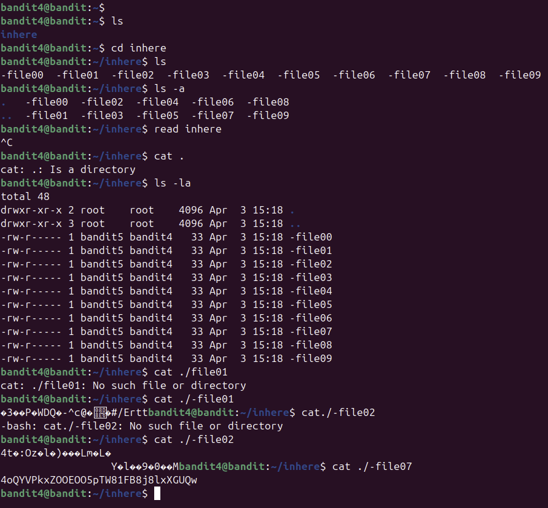

### What I Learned
I learned I should have used `file` command to identify the type of data stored inside files. This is useful when working with directories full of unknown or binary files because it helps quickly locate readable text instead of the method I used by attempting to open files individually.

# 🐧 Bandit Level 5 → Level 6

---

### **Challenge**
Inside the inhere directory, there are many subdirectories, each containing multiple files.
Only one file contains the password, and it matches these conditions:

- human‑readable
- 1033 bytes in size
- not executable

Your task is to find the correct file using Linux commands.

---

### **What This Level Is Teaching**

- How to search recursively through directories
- How to filter files by size
- How to identify readable vs non‑readable files
- How to use find with multiple conditions
- How to combine commands to locate a specific file efficiently

---

### **Hints (Medium Difficulty)**

- Use find to search through all subdirectories
- Use -size 1033c to match a file of exactly 1033 bytes
- Use -readable to filter readable files
- Use ! -executable to exclude executable files
- Combine them into one command

---

### **Solution (Commands I Used)**

- ls
- cd inhere
- find . -type f -size 1033c -readable ! -executable

Once the correct file is found:
cat <path-to-file>

### Explanation
- cd inhere moves into the directory containing many nested folders
- find . searches recursively from the current directory
- -type f ensures we only look at files
- -size 1033c filters files that are exactly 1033 bytes
- -readable ensures the file can be read
- ! -executable excludes executable files
- The resulting file contains the password for Level 6

###  Password
HWasnPhtq9AVKe0dmk45nxy20cvUa6EG

## Screenshot
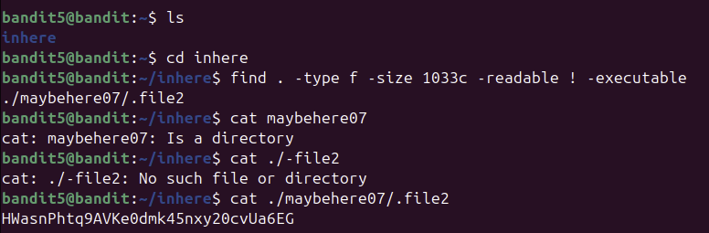

### What I Learned
I learned how to use the `find` command with multiple conditions to search through nested directories. This level showed me how to filter files by size, readability, and permissions, which is extremely useful when working with large directory structures in real DevOps environments.

# 🐧 Bandit Level 6 → Level 7

---

### **Challenge**
The password for the next level is stored somewhere on the server in a file that meets all of these conditions:
- owned by user bandit7
- owned by group bandit6
- 33 bytes in size

Your task is to search the entire filesystem and locate this file.

---

### **What This Level Is Teaching**

- How to search the entire filesystem using find
- How to filter by user, group, and file size
- How to handle permission‑denied errors
- How to combine multiple conditions in one command

---

### **Hints (Medium Difficulty)**

- Use / as the search root to scan the whole system
- Use:
    - -user bandit7
    - -group bandit6
    - -size 33c

- Expect many “Permission denied” messages — this is normal
- Use 2>/dev/null to hide error messages

---

### **Solution (Commands I Used)**

- find / -type f -user bandit7 -group bandit6 -size 33c 2>/dev/null
Once the correct file is found:
- cat /var/lib/dpkg/info/bandit7.password

### Explanation
- find / searches from the root of the filesystem
- -type f ensures only files are returned
- -user bandit7 filters files owned by the correct user
- -group bandit6 filters by group
- -size 33c finds files exactly 33 bytes in size
- 2>/dev/null hides permission errors so the output is clean
- The matching file contains the password for Level 7

###  Password
morbNTDkSW6jIlUc0ymOdMaLnOlFVAaj

## Screenshot
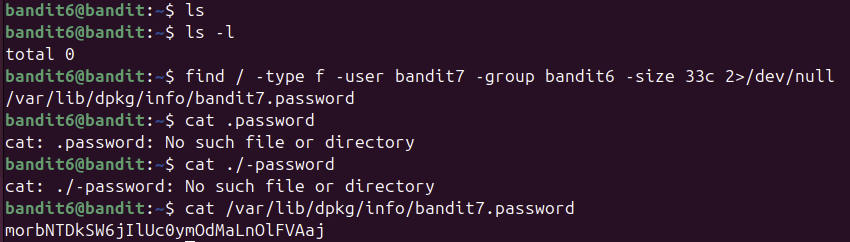

### What I Learned
I learned how to use the `find` command to search the entire filesystem using multiple filters such as user, group, and file size. I also learned how to redirect error messages using `2>/dev/null`, which keeps the output clean when searching directories I don’t have permission to access.

# 🐧 Bandit Level 7 → Level 8

---

### **Challenge**
The password for the next level is stored in a file called data.txt.
Inside this file, you must find the only line that contains the word “millionth” — that line contains the password.

---

### **What This Level Is Teaching**

- How to search inside files using the grep command
- How to filter text efficiently
- How to locate a specific line in a large file
- How pattern matching works in Linux

---

### **Hints (Medium Difficulty)**

- Use ls to confirm the file exists
- Use grep to search for the keyword
- The output will be a single line containing the password

---

### **Solution (Commands I Used)**

- ls
- grep millionth data.txt

### Explanation
- ls shows the file data.txt
- grep millionth data.txt searches the file for the word “millionth”
- grep prints the entire matching line
- That line contains the password for Level 8

###  Password
dfwvzFQi4mU0wfNbFOe9RoWskMLg7eEc

## Screenshot
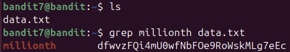

### What I Learned
I learned how to use the `grep` command to search for specific text inside a file. This is useful when working with large logs or configuration files because it allows me to quickly locate the exact line or pattern I need without manually scrolling through the entire file.

# 🐧 Bandit Level 8 → Level 9

---

### **Challenge**
The password for the next level is stored in the file data.txt.
Inside this file, one line appears only once, while all other lines appear multiple times.
Your task is to find the unique line — that line contains the password.

---

### **What This Level Is Teaching**

- How to sort data using sort
- How to find unique or repeated lines using uniq
- How to combine commands using pipes (|)
- How to process large text files efficiently
- How to identify anomalies in logs (very DevOps‑relevant)

---

### **Hints (Medium Difficulty)**

- uniq only works on sorted data
- So you must sort the file first
- Use:
    - sort data.txt | uniq -u
    - uniq -u prints only the line that appears once

---

### **Solution (Commands I Used)**

ls
sort data.txt | uniq -u

### Explanation
- sort data.txt arranges all lines in order
- uniq -u filters out all repeated lines and prints only the unique one
- The output is a single line — the password for Level 9

###  Password
4CKMh1JI91bUIZZPXDqGanal4xvAg0JM

## Screenshot
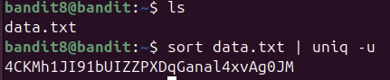

### What I Learned
I learned how to combine `sort` and `uniq` to find unique lines in a file. This is a powerful technique for analysing logs, detecting anomalies, and filtering out duplicate entries — all common tasks in DevOps and system administration.

# 🐧 Bandit Level 10 → Level 11

---

### **Challenge**
The password for the next level is stored in the file data.txt, but the contents are base64 encoded.
Your task is to decode the file and extract the password.

---

### **What This Level Is Teaching**

- How to recognise base64‑encoded text
- How to decode base64 using the base64 command
- How to pipe file contents into a decoder
- How encoding/decoding is used in real DevOps workflows

---

### **Hints (Medium Difficulty)**

- Base64 text often ends with = or ==
- Use:
    base64 -d data.txt
Or:
    cat data.txt | base64 -d
- The decoded output contains the password

---

### **Solution (Commands I Used)**
ls
cat data.txt | base64 -d

### Explanation
- base64 -d tells Linux to decode the file
- The output is plain text
- The decoded line contains the password for Level 11

###  Password
dtR173fZKb0RRsDFSGsg2RWnpNVj3qRr

## Screenshot
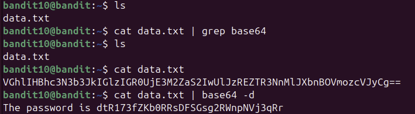

### What I Learned
I learned how to decode base64‑encoded data using the `base64 -d` command. This is useful in DevOps when working with encoded secrets, environment variables, or logs that store information in base64 for safety or formatting reasons.

# 🐧 Bandit Level 11 → Level 12

---

### **Challenge**
The password for the next level is stored in the file data.txt, but the text is encoded using ROT13 — a simple substitution cipher that shifts each letter 13 places in the alphabet.
Your task is to decode the file and extract the password.

---

### **What This Level Is Teaching**

- How to recognise ROT13‑encoded text
- How to decode ROT13 using the tr command
- How to transform text using character mappings
- How to pipe file contents into a decoder

---

### **Hints (Medium Difficulty)**

- ROT13 only affects letters, not numbers
- Use the tr command to rotate characters
- The mapping is:
    A-Za-z  →  N-ZA-Mn-za-m
- Combine with cat to decode the file

---

### **Solution (Commands I Used)**
ls
cat data.txt | tr 'A-Za-z' 'N-ZA-Mn-za-m'

### Explanation
- cat data.txt prints the encoded text
- tr 'A-Za-z' 'N-ZA-Mn-za-m' rotates each letter by 13 positions
- The output is the decoded message
- The decoded line contains the password for Level 12

###  Password
7x16WNeHIi5YkIhWsfFIqoognUTyj9Q4

## Screenshot
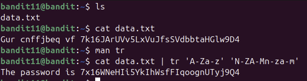

### What I Learned
I learned how to decode ROT13 text using the `tr` command by mapping each letter to the one 13 positions ahead. This showed me how Linux can transform text using character substitution, which is useful for decoding simple ciphers or processing text in scripts.

# 🐧 Bandit Level 12 → Level 13

---

### **Challenge**
The password for the next level is stored in a file called:
data.txt
…but the contents are not readable.
Instead, the file contains a hexdump of a compressed file.
You must:
        - Convert the hexdump back into a binary file
        - Identify the file type
        - Decompress it
        - Repeat this process multiple times
        - Eventually extract the password

This level teaches real DevOps troubleshooting: peeling back unknown file formats until you reach the truth.

---

### **What This Level Is Teaching**

- How to reverse a hexdump using xxd -r
- How to identify file types using file
- How to decompress multiple archive formats:
    - gzip
    - bzip2
    - tar
- How to rename files to match their correct extensions
- How to work step‑by‑step through unknown data

---

### **Hints (Medium Difficulty)**

- Convert the hexdump back to binary:
    - xxd -r data.txt > data
- Use file data to see what type it is
- Rename the file to match the type (e.g., .gz, .bz2, .tar)
- Decompress using:
    - gzip -d
    - bzip2 -d
    - tar -xf
- Repeat until you reach a plain text file

---

### **Solution (Commands I Used)**
mkdir /tmp/zishan
cd /tmp/zishan

xxd -r ~/data.txt > data
file data

mv data data.gz
gzip -d data.gz

file data
mv data data.bz2
bzip2 -d data.bz2

file data
mv data data.tar
tar -xf data.tar

file <newfile>
...

### Explanation
- xxd -r reverses the hexdump back into a binary file
- file tells you what kind of compressed file it is
- You rename the file so the decompression tools recognise it
- You decompress layer by layer
- After several iterations, you reach the final text file
- That file contains the password for Level 13

###  Password
FO5dwFsc0cbaIiH0h8J2eUks2vdTDwAn

## Screenshot
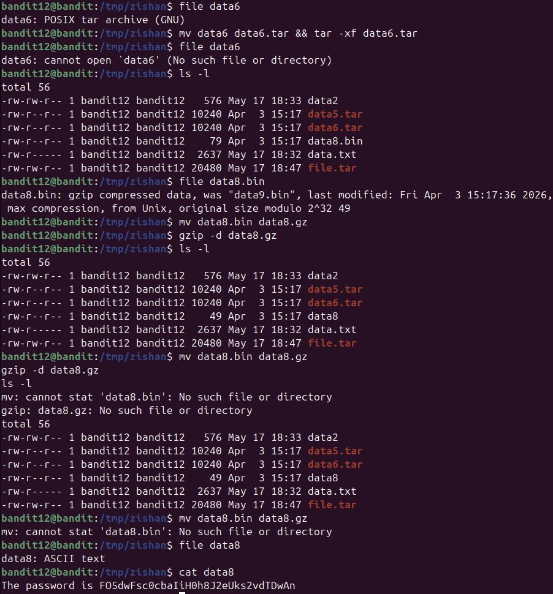

### What I Learned
I learned how to reverse a hexdump using `xxd -r` and how to identify unknown file types using the `file` command. This level taught me how to work through multiple layers of compression formats like gzip, bzip2, and tar, which is a valuable DevOps skill when dealing with logs, backups, or corrupted files.

# 🐧 Bandit Level 13 → Level 14

---

### **Challenge**
You are given a private SSH key stored in:
sshkey.private

You must use this key to log in as bandit14 on the Bandit server.
Once logged in, the password for the next level is stored in:
/etc/bandit_pass/bandit14

---

### **What This Level Is Teaching**

- How SSH key‑based authentication works
- How to use a private key with the ssh command
- How to set correct permissions on private keys
- How to read system‑level password files
- Why SSH keys are more secure than passwords

---

### **Hints (Medium Difficulty)**

- SSH refuses to use a private key if its permissions are too open
- Fix permissions using:
chmod 600 sshkey.private

- Use the key to log in:
ssh -i sshkey.private bandit14@bandit.labs.overthewire.org -p 2220

- Once logged in, read the password file:
cat /etc/bandit_pass/bandit14

---

### **Solution (Commands I Used)**
ls
chmod 600 sshkey.private
ssh -i sshkey.private bandit14@bandit.labs.overthewire.org -p 2220
cat /etc/bandit_pass/bandit14

### Explanation
- chmod 600 restricts the key so only you can read/write it
- ssh -i tells SSH to use your private key instead of a password
- The server verifies the key and logs you in as bandit14
- The password file is stored in /etc/bandit_pass/
- Reading that file gives you the password for Level 14

###  Password
MU4VWeTyJk8ROof1qqmcBPaLh7lDCPvS

## Screenshot
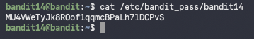

### What I Learned
I learned how to authenticate to a remote server using an SSH private key with the `ssh -i` command. I also learned why private keys require strict permissions and how to fix them using `chmod 600`. This level taught me a real DevOps skill because SSH key authentication is widely used for secure server access and automation.

# 🐧 Bandit Level 14 → Level 15

---

### **Challenge**
- You already have the password for bandit14 (from the previous level).
- Your task now:
    - Connect to a specific port on the Bandit server
    - Send the bandit14 password through that connection
    - The server will respond with the password for bandit15
- The port number is stored in:
    - etc/bandit_pass/bandit14

---

### **What This Level Is Teaching**
- How to use nc (netcat) to connect to TCP ports
- How to send data over a network connection
- How servers respond to input sent over sockets
- How to combine commands using pipes (|)

---

### **Hints (Medium Difficulty)**

- Use nc (netcat) to connect to the port
- The port number is shown when you log in
- Send the password using:
    - echo <password> | nc localhost <port>
The response will be the password for the next level

---

### **Solution (Commands I Used)**
1️⃣ View the port number
bash
cat /etc/bandit_pass/bandit14

This prints something like:
12345
(Your number will be different.)

2️⃣ Send the password to the port
bash
echo <bandit14-password> | nc localhost <port-number>
Example:
echo abcdefghijklmnop | nc localhost 30000
This returns the password for bandit15.

### Explanation
- chmod 600 restricts the key so only you can read/write it
- ssh -i tells SSH to use your private key instead of a password
- The server verifies the key and logs you in as bandit14
- The password file is stored in /etc/bandit_pass/
- Reading that file gives you the password for Level 14

###  Password
8xCjnmgoKbGLhHFAZlGE5Tmu4M2tKJQo

## Screenshot
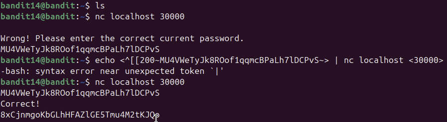

### What I Learned
I learned how to use `nc` (netcat) to connect to a TCP port and send data over a network connection. This level showed me how servers can accept input over sockets and return responses, which is a core concept in networking and DevOps.

# 🐧 Bandit Level 15 → Level 16

---

### **Challenge**
- You already have the password for bandit15.
- Your task now:
    - Connect to a remote SSL port on the Bandit server
    - Send the bandit15 password through the encrypted connection
    - The server will respond with the password for bandit16
- The SSL service is running on:
        - localhost port 30001

---

### **What This Level Is Teaching**
- How to use openssl s_client to connect to SSL/TLS services
- How encrypted sockets work
- How to send data over an SSL connection
- How to combine commands using pipes (|)
- How secure services differ from plain TCP (nc)

---

### **Hints (Medium Difficulty)**
- Use openssl s_client instead of nc
- Connect like this:
openssl s_client -connect localhost:30001
- Then type the password manually
- OR pipe it in:
    echo <password> | openssl s_client -connect localhost:30001
The response will be the password for bandit16

---

### **Solution (Commands I Used)**
View the port number
bash
cat /etc/bandit_pass/bandit14

This prints something like:
12345
(Your number will be different.)

ncat --ssl localhost 30001
type in your password

### Explanation
ncat --ssl localhost 30001

###  Password
kSkvUpMQ7lBYyCM4GBPvCvT1BfWRy0Dx

## Screenshot
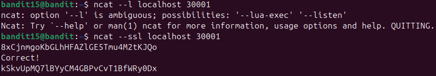

### What I Learned
I learned how to use `openssl s_client` to connect to an SSL/TLS service and send data securely. This level showed me how encrypted sockets work and how to interact with secure network services from the command line.

# 🐧 Bandit Level 16 → Level 17

---

### **Challenge**
You already have the password for bandit16.
Your task now:
- Scan all ports on localhost
- Find which port is running a service that:
    - speaks SSL
    - accepts the bandit16 password
    - returns the password for bandit17
- Connect to that port using SSL
- Send the password
- Capture the response
This is a real DevOps + security workflow: scanning, probing, and authenticating.

---

### **What This Level Is Teaching**
- How to scan ports using nmap
- How to identify SSL‑enabled services
- How to connect to SSL ports using openssl s_client
- How to test authentication on unknown ports
- How to combine scanning + probing like a security engineer

---

### **Hints (Medium Difficulty)**
- Use openssl s_client instead of nc
- Connect like this:
openssl s_client -connect localhost:30001
- Then type the password manually
- OR pipe it in:
    echo <password> | openssl s_client -connect localhost:30001
The response will be the password for bandit16

---

### **Solution (Commands I Used)**
1️⃣ Scan the port range
Code
nmap -sV -p 31000-32000 localhost
Open ports appeared, including:

31518 → ssl/echo

31790 → ssl/unknown (correct port)

2️⃣ Connect to the SSL port
Code
openssl s_client -connect localhost:31790
The service responds with:

Code
Wrong! Please enter the correct current password.
This confirms it expects authentication.

3️⃣ Send the bandit16 password
Code
echo kSkvUpMQ7lBYyCM4GBPvCvT1BfWRy0Dx | openssl s_client -connect localhost:31790
The server returns:

Code
KEYUPDATE
DONE
And earlier in the output, the private key for bandit17 was printed.

4️⃣ Save the private key
On bandit16:

Code
mkdir /tmp/lev17
cd /tmp/lev17
nano private.key
Paste the key.

Set permissions:

Code
chmod 400 private.key
5️⃣ SSH into bandit17 (IMPORTANT)
You cannot SSH from inside bandit16 — the server blocks localhost connections.

You must SSH from your own machine:

Code
ssh -i bandit17.key bandit17@bandit.labs.overthewire.org -p 2220

### Explanation
ncat --ssl localhost 30001

###  Password
kSkvUpMQ7lBYyCM4GBPvCvT1BfWRy0Dx

## Screenshot
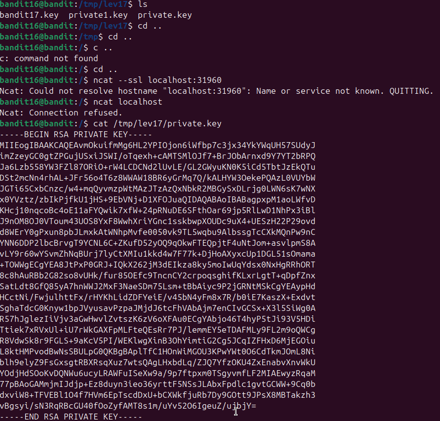

### What I Learned
I learned how to use `nmap` to scan a range of ports and identify which ones are running SSL services. I also learned how to connect to SSL ports using `openssl s_client` and how to send data securely over an encrypted connection. This level taught me practical skills used in DevOps, networking, and security testing.

# 🐧 Bandit Level 17 → Level 18

---

### **Challenge**
You already have the password for bandit17.
Your task now:
- There is a file called passwords.new
- There is another file called passwords.old
- You cannot read passwords.new directly because of permissions
- But you can read passwords.old
- The password for bandit18 is the line that is present in passwords.new but NOT in passwords.old
This is a classic diff challenge.

---

### **What This Level Is Teaching**
- How to compare two files using the diff command
- How to identify differences between versions
- How file permissions restrict access
- How to extract the unique line from a comparison

---

### **Hints (Medium Difficulty)**
- You can read:
cat passwords.old

- You cannot read:
cat passwords.new

- But you can run:
diff passwords.old passwords.new

The output will show the line that changed
That changed line is the password for bandit18

---

### **Solution (Commands I Used)**
ls
diff passwords.old passwords.new

The output will look like:
< oldpassword
> newpassword
The line starting with > is the password for bandit18.

### Explanation
- diff compares two files line‑by‑line
- < means the line exists in the old file
- > means the line exists in the new file
- Since you cannot read passwords.new directly, diff reveals the difference
- The new line (> something) is the password for the next level

###  Password
x2gLTTjFwMOhQ8oWNbMN362QKxfRqGlO

## Screenshot
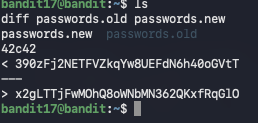

### What I Learned
I learned how to use the `diff` command to compare two files and identify the differences between them. Even though I couldn’t read the new file directly due to permissions, `diff` allowed me to see which line had changed. This is a useful skill for version control, configuration management, and debugging.

# 🐧 Bandit Level 18 → Level 19

---

### **Challenge**
The shell for bandit18 is intentionally broken.
When you try to log in normally, it immediately prints:

Byebye!
and disconnects you.

Your task:
    - You cannot get an interactive shell
    - You must bypass the broken shell
    - You need to read the file:

/etc/bandit_pass/bandit18
This file contains the password for bandit19.
This level teaches how to run commands over SSH before the shell loads.

---

### **What This Level Is Teaching**
- How to bypass a restricted or broken shell
- How to run commands directly over SSH
- How to use here‑documents (<< EOF)
- How to read files even when interactive login is blocked

---

### **Hints (Medium Difficulty)**
- Logging in normally will always fail
- You must run the command as part of the SSH connection
- A here‑document sends commands before the shell loads
- This avoids the .bashrc logout

---

### **Solution (Commands I Used)**
ssh bandit18@bandit.labs.overthewire.org -p 2220 "cat readme"

### Explanation
- diff compares two files line‑by‑line
- < means the line exists in the old file
- > means the line exists in the new file
- Since you cannot read passwords.new directly, diff reveals the difference
- The new line (> something) is the password for the next level

###  Password
cGWpMaKXVwDUNgPAVJbWYuGHVn9zl3j8

## Screenshot
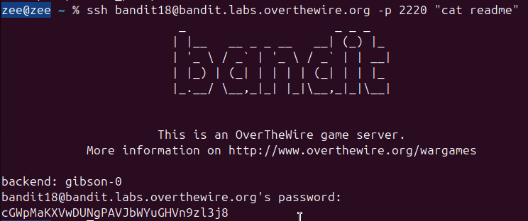

### What I Learned
I learned how to bypass a broken or restricted shell by executing commands directly over SSH before the shell loads. Using a here‑document allowed me to run cat on the password file even though interactive login was blocked. This is a valuable technique for automation, debugging, and working with limited environments in Linux and DevOps.

# 🐧 Bandit Level 19 → Level 20

---

### **Challenge**
- You now have the password for bandit19.
- Your task:
        - There is a special binary called bandit20-do
        - This binary runs commands as the user bandit20
        - You must use it to read the file:
                                    /etc/bandit_pass/bandit20
- You cannot read this file normally because you are bandit19, not bandit20.
- This level teaches how setuid binaries allow privilege escalation in a controlled, safe way.

---

### **What This Level Is Teaching**
- What a setuid binary is
- How to run a command as another user
- How to pass arguments to a binary
- How Linux permissions can be elevated safely

---

### **Hints (Medium Difficulty)**
Check the binary permissions:

ls -l bandit20-do

You will see something like:

-rwsr-x--- 1 bandit20 bandit19 12345 Jan 1 00:00 bandit20-do

The s in rws means setuid — it runs as the file owner (bandit20).

You can test it by running:

./bandit20-do whoami
It should output:

bandit20
To read the password file, run:

./bandit20-do cat /etc/bandit_pass/bandit20

---

### **Solution (Commands I Used)**
ls -l bandit20-do
whoami
./bandit20-do whoami
./bandit20-do cat /etc/bandit_pass/bandit20

### Explanation
- bandit20-do is owned by bandit20
- Because it has the setuid bit, it executes with bandit20’s permissions
- Running:
        ./bandit20-do cat /etc/bandit_pass/bandit20
is equivalent to running:
sudo -u bandit20 cat /etc/bandit_pass/bandit20
- This allows you to read the protected password file even though you are logged in as bandit19
- This is a real Linux privilege‑escalation mechanism used in system administration and DevOps.

###  Password
0qXahG8ZjOVMN9Ghs7iOWsCfZyXOUbYO

## Screenshot
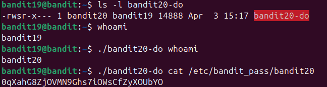

### What I Learned
I learned how setuid binaries work and how they allow a user to execute commands with the permissions of another user. By using the bandit20-do binary, I was able to run the cat command as bandit20 and read the protected password file. This is an important concept in Linux privilege management, privilege escalation, and secure system design.

